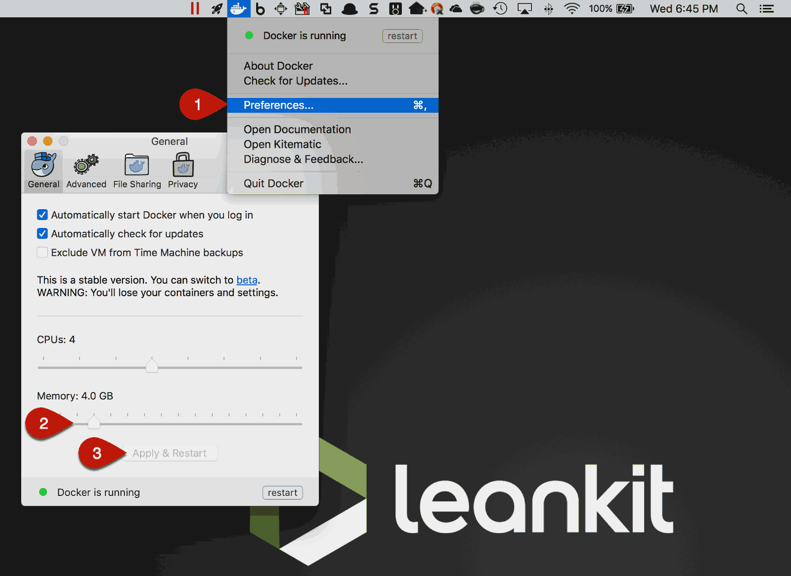
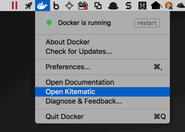

= Install and configure Docker

If you don’t already have Docker installed, you’ll need to https://docs.docker.com/docker-for-mac/[download and install it].
Next step, you’ll need to increase Docker’s available memory to 4GB or more.

1. Docker -> Preferences
2. Increase Memory to at least 4GB
3. Click Apply & Restart

== Tip: Get Kitematic

Kitematic is a nice desktop application for managing Docker containers. The first time you click **Open Kitematic**,
it will prompt you to download and install it. You can then use Kitematic to view the output of your containers, manage their settings, etc.

